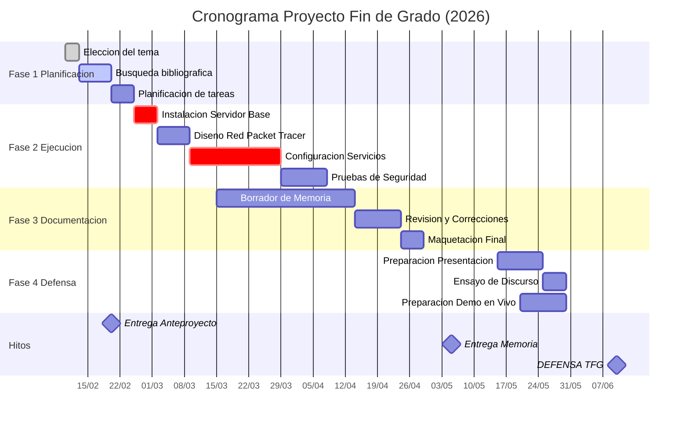

# Planificación TFG - ASIR

```mermaid
gantt
    title Cronograma Proyecto Fin de Grado (2026)
    dateFormat  YYYY-MM-DD
    axisFormat  %d/%m

    section Fase 1 Planificacion
    Eleccion del tema           :done,    F1a, 2026-02-10, 3d
    Busqueda bibliografica      :active,  F1b, after F1a, 7d
    Planificacion de tareas     :         F1c, after F1b, 5d

    section Fase 2 Ejecucion
    Instalacion Servidor Base   :crit,    F2a, 2026-02-25, 5d
    Diseno Red Packet Tracer    :         F2b, after F2a, 7d
    Configuracion Servicios     :crit,    F2c, after F2b, 20d
    Pruebas de Seguridad        :         F2d, after F2c, 10d

    section Fase 3 Documentacion
    Borrador de Memoria         :         F3a, 2026-03-15, 30d
    Revision y Correcciones     :         F3b, after F3a, 10d
    Maquetacion Final           :         F3c, after F3b, 5d

    section Fase 4 Defensa
    Preparacion Presentacion    :         F4a, 2026-05-15, 10d
    Ensayo de Discurso          :         F4b, after F4a, 5d
    Preparacion Demo en Vivo    :         F4c, 2026-05-20, 10d

    section Hitos
    Entrega Anteproyecto        :milestone, 2026-02-20, 0d
    Entrega Memoria             :milestone, 2026-05-05, 0d
    DEFENSA TFG                 :milestone, 2026-06-10, 0d
```
