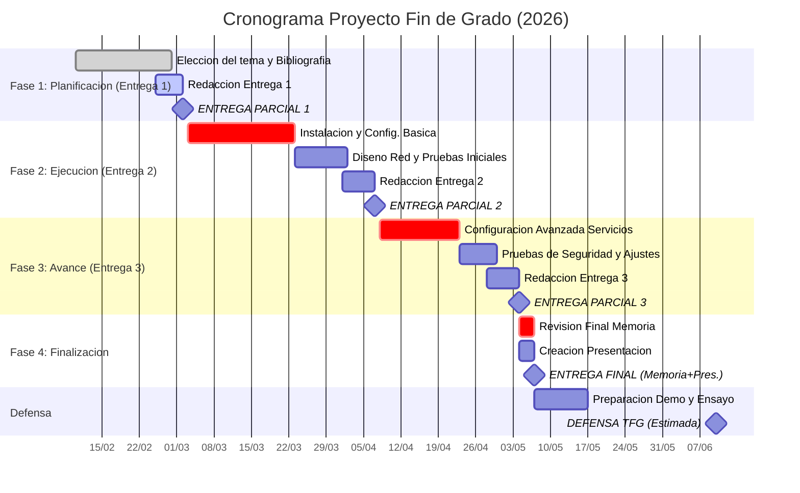

# Planificación TFG - ASIR

```mermaid
gantt
    title Cronograma Proyecto Fin de Grado (2026)
    dateFormat  YYYY-MM-DD
    axisFormat  %d/%m

    section Fase 1: Planificacion (Entrega 1)
    Eleccion del tema y Bibliografia :done,    T1, 2026-02-10, 2026-02-28
    Redaccion Entrega 1              :active,  T2, 2026-02-25, 5d
    ENTREGA PARCIAL 1                :milestone, M1, 2026-03-02, 0d

    section Fase 2: Ejecucion (Entrega 2)
    Instalacion y Config. Basica     :crit,    T3, 2026-03-03, 20d
    Diseno Red y Pruebas Iniciales   :         T4, after T3, 10d
    Redaccion Entrega 2              :         T5, 2026-04-01, 6d
    ENTREGA PARCIAL 2                :milestone, M2, 2026-04-07, 0d

    section Fase 3: Avance (Entrega 3)
    Configuracion Avanzada Servicios :crit,    T6, 2026-04-08, 15d
    Pruebas de Seguridad y Ajustes   :         T7, after T6, 7d
    Redaccion Entrega 3              :         T8, 2026-04-28, 6d
    ENTREGA PARCIAL 3                :milestone, M3, 2026-05-04, 0d

    section Fase 4: Finalizacion
    Revision Final Memoria           :crit,    T9, 2026-05-04, 3d
    Creacion Presentacion            :         T10, 2026-05-04, 3d
    ENTREGA FINAL (Memoria+Pres.)    :milestone, M4, 2026-05-07, 0d

    section Defensa
    Preparacion Demo y Ensayo        :         T11, after M4, 10d
    DEFENSA TFG (Estimada)           :milestone, M5, 2026-06-10, 0d
```
