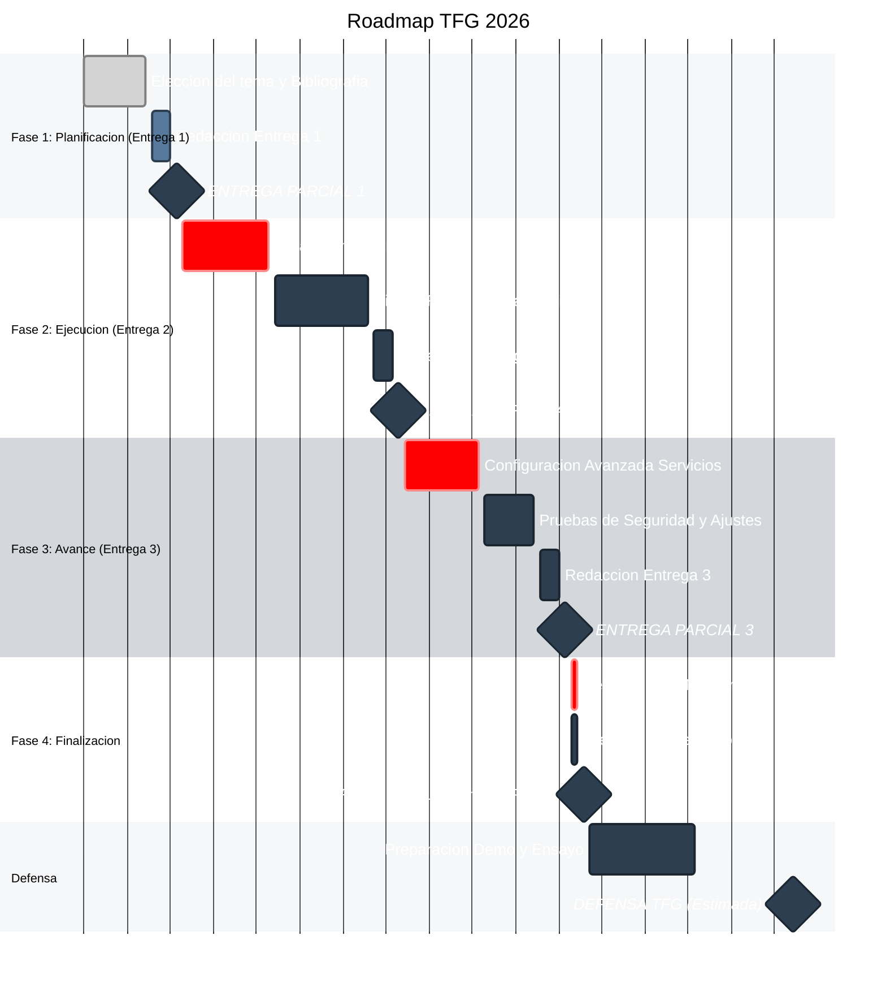

# 🎓 Proyecto TFG - Administración de Sistemas (ASIR)

Este documento detalla la planificación temporal estricta para el desarrollo del Trabajo de Fin de Grado, estructurado en 4 fases de entrega y la defensa final.

> **Nota:** Para ver los cálculos de días restantes en tiempo real, abre el archivo `dashboard.html` en tu navegador o [haz clic aquí](dashboard.html) si estás viendo este repositorio en local. Si estás en GitHub, necesitas activar **GitHub Pages** para verlo online.

---

## 📅 Cronograma Visual

---

## 📋 Detalle de Tareas

| Fase | Tarea | Periodo | Duración | Días hasta Entrega* |
| :--- | :--- | :--- | :--- | :---: |
| **Fase 1** | 🔍 Elección del tema y Bibliografía | 15 Feb - 20 Feb | 6 días | - |
| | 📅 Planificación Detallada | 21 Feb - 25 Feb | 5 días | - |
| | ✍️ **Redacción Entrega 1** | **26 Feb - 01 Mar** | **4 días** | 3 Semanas |
| | 🏁 **HITO: Entrega Parcial 1** | **02 Mar** | | **22 días** |
| **Fase 2** | 🖥️ Instalación Servidor Base | 03 Mar - 15 Mar | 13 días | - |
| | 🌐 Diseño Red y Config. Básica | 16 Mar - 02 Abr | 18 días | - |
| | ✍️ **Redacción Entrega 2** | **03 Abr - 06 Abr** | **4 días** | ~2 Meses |
| | 🏁 **HITO: Entrega Parcial 2** | **07 Abr** | | **58 días** |
| **Fase 3** | ⚙️ Config. Avanzada Servicios | 08 Abr - 22 Abr | 15 días | - |
| | 🔒 Pruebas de Seguridad y Ajustes | 23 Abr - 29 Abr | 7 días | - |
| | ✍️ **Redacción Entrega 3** | **30 Abr - 03 May** | **4 días** | ~3 Meses |
| | 🏁 **HITO: Entrega Parcial 3** | **04 May** | | **85 días** |
| **Fase 4** | 📖 **Revisión Final Memoria** | **05 May - 06 May** | **2 días** | - |
| | 🏆 **HITO: Entrega Final Memoria** | **07 May** | | **88 días** |
| **Defensa** | 📢 Preparación Presentación y Guion | 08 May - 15 May | 8 días | - |
| | 🎭 Ensayo y Preparación Demo | 16 May - 25 May | 10 días | - |
